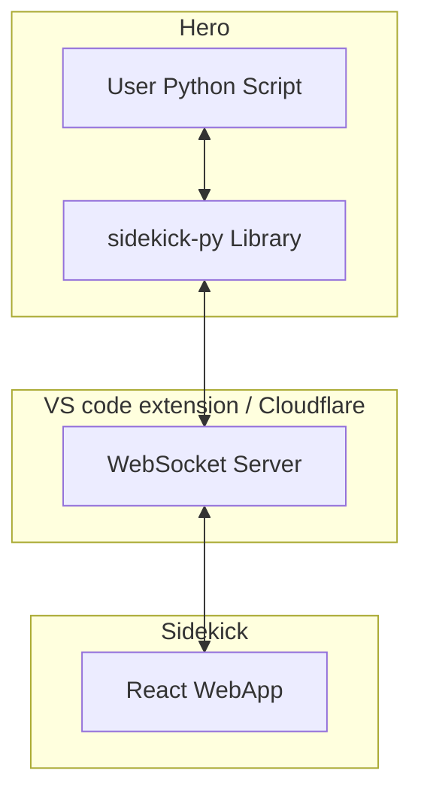
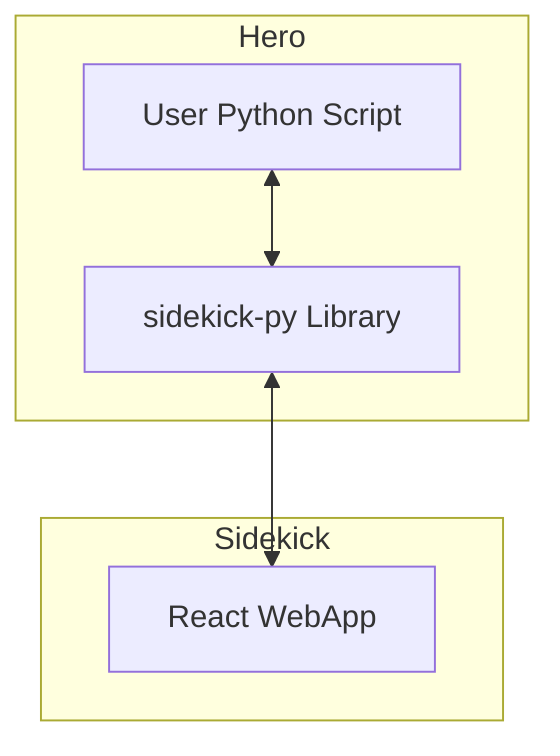

# Sidekick System Architecture

## 1. Overview

This document provides a high-level technical overview of the Sidekick system architecture. It explains the main components, their responsibilities, and how they interact.

### 1.1 Goals

1.  **Suitable for Education & Ease of Use**: Sidekick aims to be an easy-to-use UI visualization tool, particularly for educational purposes. It provides fundamental UI components rather than being a comprehensive UI framework.
2.  **Modern, Elegant, Pythonic Design**: The library and its usage are designed to be intuitive and align with modern Pythonic practices.
3.  **Separation of Concerns**: Programming logic (Hero) is decoupled from the display logic (Sidekick). Communication between them occurs via a language-agnostic and platform-agnostic protocol.

### 1.2 Roles

1.  **Hero**: This consists of the user's script and the Sidekick library. Currently, a Python library (`sidekick-py`) is provided. The Hero script contains the user's code and logic that drives the visualizations.
2.  **Sidekick UI**: This is a React application responsible for rendering the visual components. It typically displays within a VS Code panel but can also run in a standard web browser.
3.  **WebSocket Server (Optional)**: In CPython mode, a WebSocket server acts as a message relay between the Hero (Python script) and the Sidekick UI. In Pyodide mode, messages can be exchanged directly between the Python environment in the browser and the React UI, bypassing the need for an external WebSocket server.

### 1.3 Modes

Sidekick can operate in two primary modes depending on how the Python code (Hero) is executed:

1.  **CPython Mode**: The user's Python script runs as an independent process using a standard CPython interpreter. Communication with the Sidekick UI is typically facilitated by a WebSocket server.
2.  **Pyodide Mode**: The user's Python script runs directly in the browser using Pyodide (a Python runtime compiled to WebAssembly). Communication with the Sidekick UI happens through direct JavaScript message passing.

### 1.4 Architecture Diagrams

#### 1.4.1 CPython Mode

#### 1.4.2 Pyodide Mode

## 2. Python Library (`sidekick-py`)

The `sidekick-py` library is the interface for Python scripts to interact with the Sidekick UI.

1.  **Environment Detection**: If the library detects it's running in a Pyodide environment, it prioritizes Pyodide mode for communication (direct JavaScript messaging).
2.  **Connection Strategy (CPython Mode)**:
    *   It first attempts to connect to a local WebSocket server (typically provided by the VS Code extension).
    *   If the local connection fails, it may then attempt to connect to a fallback cloud-based WebSocket server.
3.  **Reference**: For more details, see [Python Library Development Guide (python-development.md)](./python-development.md).

## 3. WebApp (Sidekick UI)

The Sidekick UI is a React-based web application that renders the visualizations.

1.  **CPython Mode Connection**: When the UI URL contains a path like `.../session/xxxx` (where `xxxx` is a session ID), it indicates CPython mode. The UI will attempt to connect to a WebSocket server using this session ID to join the correct communication channel.
2.  **Pyodide Mode Connection**: When the UI URL might indicate a script to load (e.g. `.../script/xxxx`, where `xxxx` is a script identifier), it operates in Pyodide mode. The WebApp loads and runs the Python script using Pyodide, and communication happens directly via JavaScript bridging.
3.  **Dynamic Endpoint Configuration**: The WebApp uses the session ID (from the URL in CPython mode) to construct the WebSocket server URL or the script ID (in Pyodide mode) to fetch and run the appropriate script.
4.  **Reference**: For more details, see [Sidekick Web Application Development Guide (webapp-development.md)](./webapp-development.md).

## 4. VS Code Extension (`sidekick-coding`)

The VS Code extension enhances the Sidekick experience.

1.  **Optional & Local**: It allows Sidekick to be used locally without relying on an internet connection for a WebSocket server, generally resulting in faster response times.
2.  **Local WebSocket Server**: The extension runs a local WebSocket server on the user's machine to relay messages between the CPython Hero script and the Sidekick UI.
3.  **Integrated Panel**: It provides a "Sidekick Panel" within VS Code, using a Webview to host and display the Sidekick UI (React app).
4.  **Reference**: For more details, see [Sidekick VS Code Extension Development Guide (extension-development.md)](./extension-development.md).

## 5. Cloudflare Server Infrastructure

This provides a cloud-based fallback solution when a local server (e.g., from the VS Code extension) is not available.

1.  **Fallback Solution**: It serves as an alternative WebSocket relay and UI hosting service if the VS Code extension is not installed or a local server cannot be reached.
2.  **WebSocket Server (Durable Objects)**: Cloudflare Durable Objects are used to implement the WebSocket server. Each communication session is isolated by a `sessionId`. The server relays messages only between peers (Hero and Sidekick UI) sharing the same `sessionId`.
3.  **UI Hosting (Cloudflare Pages)**: The Sidekick UI (React web application) can be hosted on Cloudflare Pages, providing global distribution.
4.  **Reference**: For more details, see [Sidekick Server-Side Development Guide (Cloudflare) (cloudflare-development.md)](./cloudflare-development.md).

## 6. Communication Protocol

The communication between the Hero (Python library) and the Sidekick UI (React app) follows a defined protocol.

1.  **Real-time & Bi-directional**: The protocol supports real-time, two-way communication. Messages are encoded in JSON format.
2.  **Hero to Sidekick**: Messages from the Hero to the Sidekick UI are primarily *control messages*. These include commands to `spawn` (create) new UI components, `update` their properties, or `remove` them.
3.  **Sidekick to Hero**: Messages from the Sidekick UI back to the Hero are typically *event messages* (e.g., a button click, text submission) or *error messages* if the UI encounters an issue processing a command.
4.  **Reference**: For the detailed specification, see [Sidekick Communication Protocol Specification (protocol.md)](./protocol.md).
