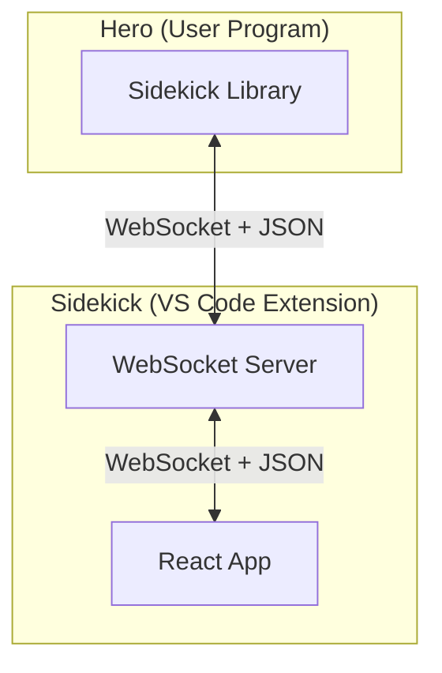

# Sidekick System Architecture

## 1. Overview

This document provides a high-level technical overview of the Sidekick system architecture. It explains the main components, their responsibilities, how they interact, and the core design principles. This is intended for developers contributing to Sidekick or seeking a conceptual understanding of its structure.

Sidekick's architecture is built on the principle of **separation of concerns**, dividing the user's programming logic (the "Hero") from the visual presentation and interaction layer (the "Sidekick" UI). Real-time communication between these layers is facilitated by a central server component (typically hosted within the VS Code extension) acting as a message relay, using a WebSocket connection.

## 2. Core Components

The system consists of three main parts:

1.  **Hero (User Program + Sidekick Library):**
    *   **User Program:** The end-user's script (e.g., a Python `.py` file) containing the logic to be visualized or interacted with.
    *   **Sidekick Library (`sidekick-py`):** A language-specific library (currently Python) providing a high-level API (`Grid`, `Console`, `Viz`, etc.). It abstracts communication details and manages the client-side connection lifecycle. See [Python Library Development Guide](./python-development.md) for details.
2.  **Sidekick Server (Typically within VS Code Extension):**
    *   **WebSocket Server:** Acts as the central **message relay or broker**. It connects Hero clients and Sidekick UI clients, forwarding messages between them based on the defined protocol. It also manages peer connections and status announcements. See [Extension Development Guide](./extension-development.md) for details.
3.  **Sidekick UI (React Web Application):**
    *   **React App:** A frontend application (usually in a VS Code Webview) responsible for rendering visual modules, handling user interactions, and managing UI state. It communicates with the Server via WebSocket. See [WebApp Development Guide](./webapp-development.md) for details.

## 3. Key Interaction Flows

*   **Command Flow (Hero -> UI):** The Hero library sends commands (like `spawn`, `update`, `remove`) via the Server to instruct the UI to create or modify visual modules.
*   **Event Flow (UI -> Hero):** The Sidekick UI sends event messages (like `click`, `inputText`) or errors back via the Server to the Hero library, allowing the user's script to react to interactions.
*   **Peer Discovery (`system/announce`):** Both Hero and Sidekick UI announce their presence (`online`/`offline`) via the Server. This allows peers to know when others are ready to communicate, preventing messages from being sent into the void. The Hero library typically buffers commands until it detects a ready Sidekick UI.

## 4. High-Level Architectural Concepts

*   **Communication Mechanism:** Primarily uses WebSockets (`ws://localhost:5163` by default) for real-time, full-duplex communication. Messages are formatted as JSON strings. The specific structure and payload requirements (including **key casing**) are defined in the [Communication Protocol Specification](./protocol.md).
*   **State Management:**
    *   **Hero State:** Resides within the user's script and the `sidekick-py` library objects.
    *   **Sidekick UI State:** Managed independently within the React application, driven by messages received from the Hero.
    *   State synchronization occurs through the command/event message flow.
*   **Modularity:** The system is designed around visual modules (Grid, Console, Viz, etc.). Each module has a corresponding implementation in the Hero library (Python class) and the Sidekick UI (React component + logic), linked by a common `module` type string in the communication protocol.
*   **Reactivity (`ObservableValue`):** The `sidekick.ObservableValue` wrapper in Python allows the `Viz` module to automatically track and visualize data changes with granular updates sent to the UI.
*   **Message Buffering:** The Hero library implements buffering for outgoing commands, queuing them if the Sidekick UI is not yet detected as ready.

## 5. Technology Stack Summary

*   **Hero Library:** Python 3.x, `websocket-client`
*   **Sidekick Server:** Node.js (within VS Code Extension), `ws` library
*   **Sidekick UI:** React, TypeScript, Vite, CSS
*   **VS Code Integration:** VS Code API (Webviews, Commands, Configuration)
*   **Communication:** WebSockets, JSON

## 6. Extensibility

The modular architecture facilitates extension:
*   **New Visual Modules:** Requires creating corresponding implementations in the Python library and the React WebApp, registering the new module type, and defining its communication payload in the protocol.
*   **New Hero Languages:** Requires creating a new client library that adheres strictly to the [Communication Protocol Specification](./protocol.md).