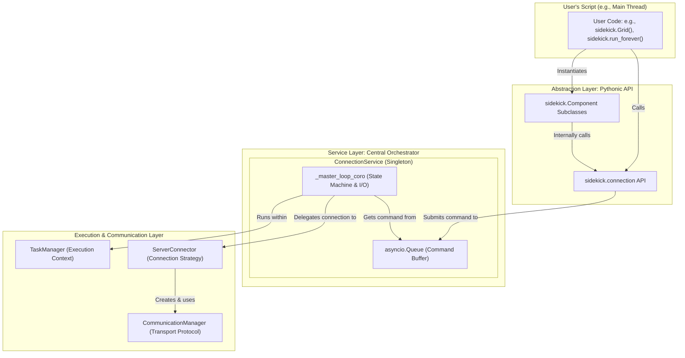

# Sidekick Python Library (`sidekick-py`) Development Guide

## 1. Overview

This document provides a comprehensive technical guide to the `sidekick-py` library. It is intended for developers contributing to the library, building integrations, or seeking a deep understanding of its internal mechanics. The guide details the library's architecture, core components, design philosophy, and key execution flows.

The primary goal of `sidekick-py` is to offer an intuitive, Pythonic API that abstracts the complexities of real-time, asynchronous communication with a UI frontend. Its architecture is designed to be robust, thread-safe for CPython environments, and adaptable to different Python runtimes like Pyodide.

## 2. Core Architecture

The library is built upon a **layered, event-driven architecture**. This design decouples user-facing components from the underlying communication and state management logic. At its heart is a command-processing loop that ensures all state transitions and I/O operations are handled sequentially in a dedicated asynchronous context, thereby preventing common concurrency issues.

The system operates as follows:
- User actions (e.g., creating a `Button` or calling `sidekick.shutdown()`) are translated into **commands**.
- These commands are placed on a thread-safe **command queue**.
- A single **master coroutine** running in a managed event loop consumes these commands.
- The master coroutine acts as a **state machine**, orchestrating all operations, including I/O, through specialized components.

## 3. Key Abstractions and Components

The architecture is composed of several key abstractions, each with a distinct responsibility.

### 3.1. `TaskManager` (Execution Context)
-   **Role**: To provide and manage an `asyncio` event loop. It abstracts away the differences between CPython and Pyodide environments. It is a singleton.
-   **Implementations**: `CPythonTaskManager` (runs a new loop in a background thread) and `PyodideTaskManager` (uses the existing loop).
-   **Key Interface**: `submit_task()`, `stop_loop()`, `wait_for_stop()`, `create_event()`.

### 3.2. `CommunicationManager` (Transport Layer)
-   **Role**: A low-level abstraction for a raw communication channel.
-   **Function**: Handles the specifics of a transport protocol (e.g., WebSocket handshake, message framing).
-   **Implementations**: `WebSocketCommunicationManager`, `PyodideCommunicationManager`.

### 3.3. `ServerConnector` (Connection Strategy)
-   **Role**: To establish a connection by trying a prioritized list of servers.
-   **Function**: Encapsulates the logic of trying local connections, then falling back to cloud servers.

### 3.4. `ConnectionService` (Service Orchestrator)
-   **Role**: The central nervous system of the library. It is a singleton that orchestrates the entire service lifecycle.
-   **Function**: Runs a **master coroutine** (`_master_loop_coro`) that acts as the service's state machine, processing requests from a **command queue** (`_command_queue`).

### 3.5. `Component` (UI Proxy)
-   **Role**: The user-facing abstraction for a UI element. All UI classes (`Grid`, `Button`, etc.) inherit from `Component`.
-   **Function**: Provides a Pythonic API, translates high-level calls into commands, and serves as the callback target for UI events.

## 4. Core Execution Flows

This section details how the key lifecycle operations are executed through the interaction of the core components.

### 4.1. Message Buffering
Before detailing specific flows, it's crucial to understand the message buffering mechanism.
- **Purpose**: To allow the user to create and manipulate components immediately, without having to manually wait for the connection to be fully active.
- **Mechanism**:
    1.  When the `ConnectionService`'s status is `IDLE` or `ACTIVATING`, all outgoing messages (like "spawn" or "update") are temporarily stored in an internal queue (`message_queue_internal`).
    2.  After the service successfully connects and completes the protocol handshake, it processes this buffer, sending all queued messages in order to the UI.
- **Effect**: This ensures all early operations are preserved and executed, providing a seamless development experience.

### 4.2. `activate_connection()` - Triggering Activation
- **Role**: A non-blocking request to ensure the service activation process is initiated.
- **Trigger**: Called either explicitly by the user or implicitly by the constructor of the first `Component` instance.
- **Flow**:
    1.  `activate_connection()` calls a method on `ConnectionService` that submits an `ACTIVATE` command to the command queue. This is a fast, non-blocking operation.
    2.  The `_master_loop_coro` (in the event loop thread) receives the `ACTIVATE` command.
    3.  If the service is `IDLE`, it transitions its state to `ACTIVATING` and asynchronously starts a new `asyncio.Task` to run the full connection and handshake sequence (`_perform_activation_sequence`).

### 4.3. `wait_for_connection()` - Synchronous Wait for Activation
- **Role**: A blocking function for CPython environments to pause the main thread until service activation is complete (successfully or with failure).
- **Flow**:
    1.  The user calls `sidekick.wait_for_connection()`.
    2.  It first calls `activate_connection()` to ensure the activation process has been triggered.
    3.  The main thread then blocks on a `threading.Event` (`_sync_activation_complete_event`).
    4.  Meanwhile, the `_perform_activation_sequence` task runs in the event loop.
    5.  When this task **completes** (on success, failure, or cancellation), its `done_callback` **sets** the `threading.Event`.
    6.  The main thread is awakened. `wait_for_connection()` then inspects the final result recorded by `ConnectionService`: it raises an exception if activation failed, or returns silently if successful.

### 4.4. `run_forever()` - Keeping the Script Alive
- **Role**: Blocks the main thread to keep the program running, allowing it to receive UI events. This is the standard final call for interactive scripts in CPython.
- **Flow**:
    1.  The user calls `sidekick.run_forever()` at the end of their script.
    2.  It first calls `wait_for_connection()` to ensure the service is `ACTIVE` before proceeding. If this fails, an exception is raised and `run_forever` terminates.
    3.  If successful, it then calls `task_manager.wait_for_stop()`.
    4.  In `CPythonTaskManager`, `wait_for_stop()` blocks on an internal `threading.Event` (`_loop_stopped_event`), which is only set when the background thread fully terminates.
    5.  This effectively pauses the main thread while allowing the background event loop to continue processing UI events.

### 4.5. `shutdown()` - Shutting Down the Service
- **Role**: To trigger a graceful shutdown of the service.
- **Flow**:
    1.  `sidekick.shutdown()` is called, submitting a `SHUTDOWN` command to the queue.
    2.  The `_master_loop_coro` receives the command and breaks out of its main processing loop.
    3.  It enters a cleanup sequence: cancels any in-progress activation task, closes the `CommunicationManager` (sending a final "hero offline" message), and finally calls `task_manager.stop_loop()`.
    4.  `task_manager.stop_loop()` signals the event loop to terminate.
    5.  In CPython, the background thread cleans up and exits, setting the `_loop_stopped_event` in the process. This unblocks the main thread if it was waiting in `run_forever()`, allowing the script to exit cleanly.

## 5. Advanced Topics and Implementation Details

### 5.1. Reactivity with `ObservableValue`
The `ObservableValue` class provides reactive updates for the `Viz` component using the **Interceptor** and **Publish/Subscribe** patterns.
-   **Interceptor**: `ObservableValue` is a wrapper that overrides the modification methods of built-in containers (`list`, `dict`, `set`), such as `append`, `__setitem__`, and `add`.
-   **Publish/Subscribe**:
    -   **Subscribe**: When `viz.show()` is called with an `ObservableValue`, the `Viz` instance subscribes to it by registering an internal callback.
    -   **Notify**: When an intercepted method is called on the wrapper, it first modifies the underlying data, then calls a `_notify()` method.
    -   **Publish**: `_notify()` iterates through all subscribers and passes them a dictionary detailing the change (e.g., type, path, new value). The `Viz` instance receives this and sends a precise update command to the UI.
-   **Attribute Delegation**: Through `__getattr__`, non-intercepted method calls are delegated to the wrapped object, allowing the `ObservableValue` to behave like the object it contains.

### 5.2. CPython Threading Model and Synchronization
In CPython, to avoid blocking the user's script, the library operates on a two-thread model.
-   **Main Thread**: Runs the user's script, handles synchronous code, and is the recipient of `KeyboardInterrupt`.
-   **Event Loop Thread**: A background `daemon` thread created by `CPythonTaskManager`. Its sole responsibility is to run the `asyncio` event loop where all asynchronous I/O and the `ConnectionService`'s core logic execute.

Safe communication between these threads is achieved using key synchronization primitives:
-   **`asyncio.Queue` (`_command_queue`)**: The primary channel for passing commands from the main thread to the event loop thread asynchronously.
-   **`loop.call_soon_threadsafe()`**: The critical mechanism used by the `TaskManager` to submit tasks from the main thread. It not only schedules the task but also **wakes up** the event loop if it is idle and waiting for I/O.
-   **`threading.Event` (`_sync_activation_complete_event`)**: Used to send a synchronous "operation complete" signal from the event loop back to the main thread, essential for `wait_for_connection`.

### 5.3. `ConnectionService` and the Command-Driven State Machine
The `ConnectionService` is implemented as a state machine driven by commands, ensuring sequential and safe operations.
-   **Command Queue (`_command_queue`)**: All external requests (e.g., from component method calls) are encapsulated as command tuples and placed on this `asyncio.Queue`.
-   **Master Coroutine (`_master_loop_coro`)**: This is the "worker" of the service. It's an `async def` function in a `while` loop that continuously `await`s the command queue.
-   **Sequential Processing**: Because a single master coroutine processes all commands, state changes (e.g., from `ACTIVATING` to `ACTIVE`), resource allocation, and I/O operations are handled sequentially. This fundamentally eliminates the need for complex locks and most race conditions.
-   **Non-Blocking I/O**: When the master coroutine performs a time-consuming I/O operation (like `await server_connector.connect_async()`), it yields control, allowing the event loop to run other microtasks, which keeps the system responsive.

## 6. Development Setup

To set up for development, clone the main Sidekick repository. For the Python library specifically, navigate to the `Sidekick/libs/python` directory. You can then install it in editable mode using pip: `pip install -e .`. This allows you to make changes to the library source code and have them immediately reflected when you run your test scripts.